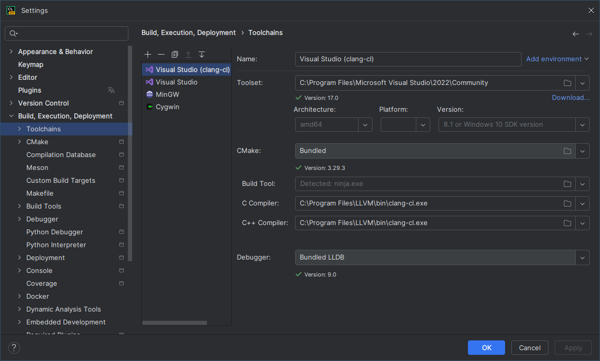
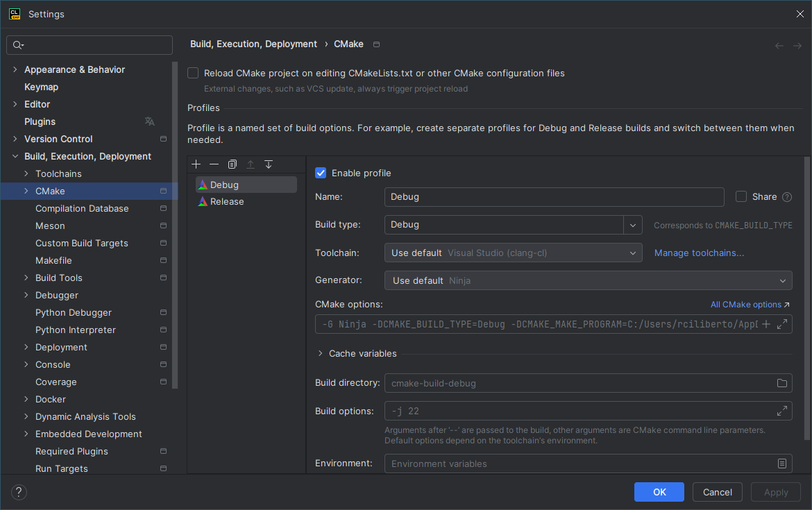
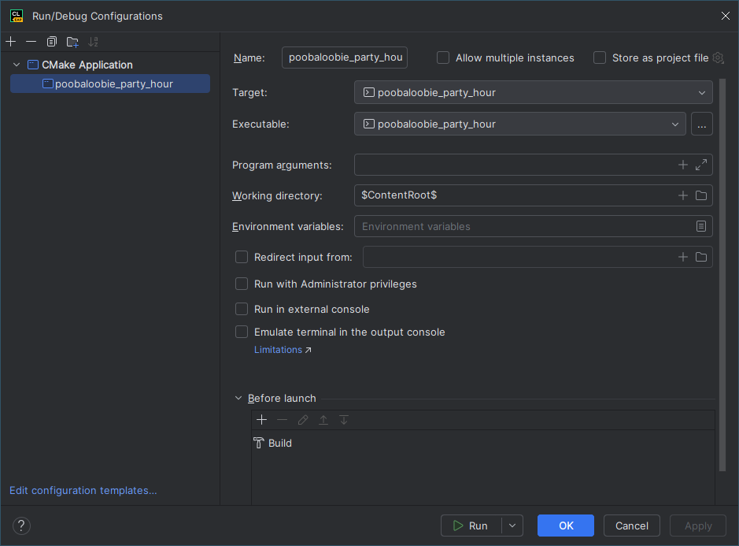

# Using CLion
by Robby Ciliberto

## About
I like to use CLion for C and C++ programming. Clion uses CMake for its build system. This won't go into the benefits or drawbacks of using CMake is or how to use it, but it will outline the steps to get CMake to build this project in CLion.

## Prerequisites
* Using windows
* MSVC Build tools installed with C/C++
* LLVM installed (for cmake and more importantly cmake-cl)

### Notes about prerequisites

The Oogabooga engine expects the Clang compiler and other compilers are not supported. However, [according to JetBrains](https://www.jetbrains.com/help/clion/quick-tutorial-on-configuring-clion-on-windows.html#clang-mingw):
> [T]he LLVM Clang for Windows is built using Microsoft Visual Studio, and all the built-in macros and include search paths are set up for use with Visual Studio.

This results in errors in syntax highlighting and code completion. The resolution to this is to use a Visual Studio toolchain using the clang-cl wrapper, which conveniently comes with the LLVM Clang for Windows!

## Setup

### CMakeLists.txt
CMake uses `CMakeLists.txt` to define build configuration. I did my best to adapt build.bat and build_release.bat into this CMake configuration 

### Toolchain Setup

Create a new `Visual Studio` Toolchain and change the C and C++ Compiler to use clang-cl that was installed with LLVM. Move it to the top to set it as the default

### CMake Profile Setup

Make sure the CMake profiles use the correct toolchain and, optionally create a Release profile to compile with optimizations.

### Run Configuration

Set Working directory to `$ContentRoot$` so the application can read the appropriate runtime data (eg assets/shader scripts).

After that you should be golden to use CLion as normal.
